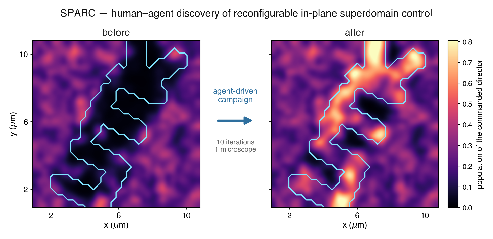
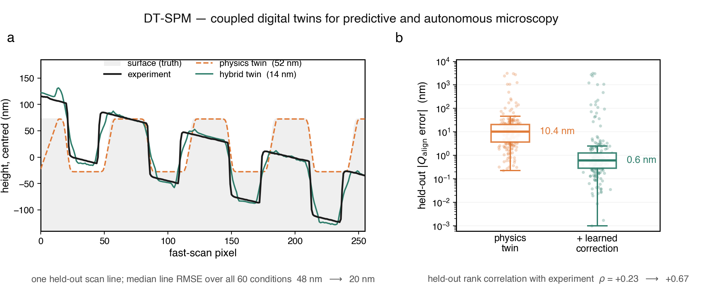
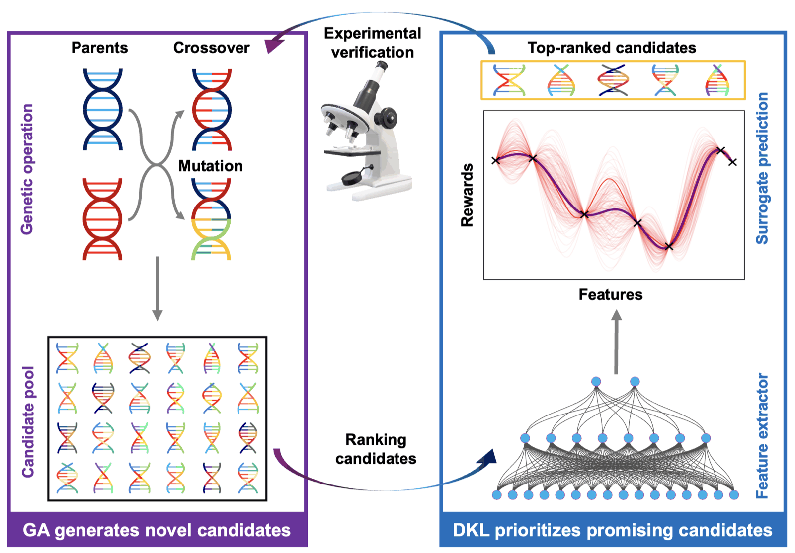
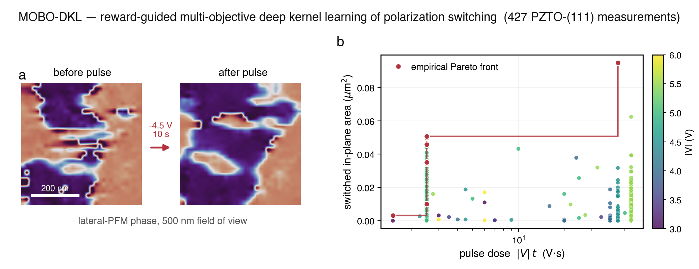
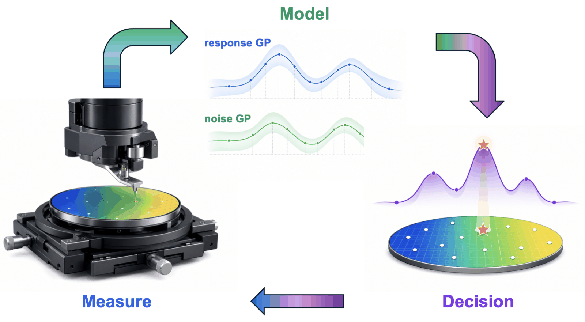
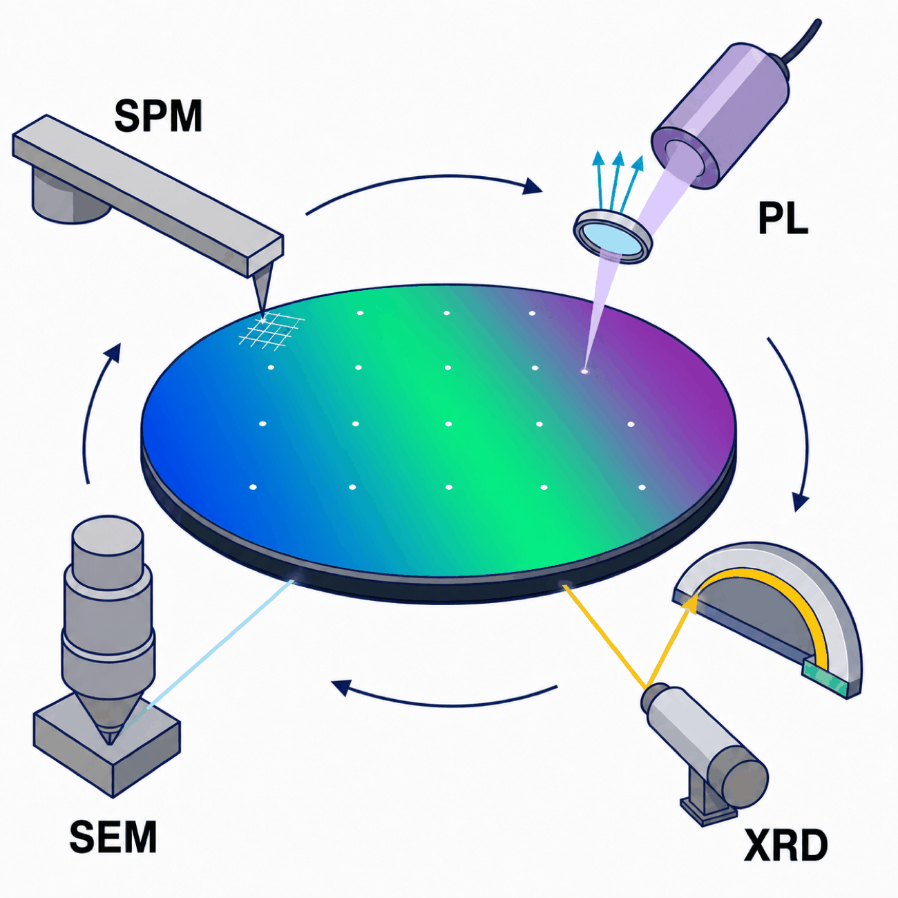
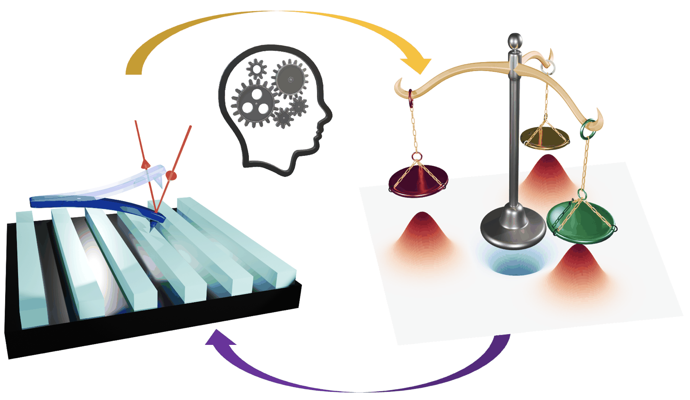

# Publications

Code, notebooks, and compact datasets behind my publications on **autonomous and
machine-learning-driven scanning probe microscopy**.

Every folder here is a self-contained release for one paper: the notebooks run top to bottom
(most of them on a free Colab CPU runtime), the data needed to reproduce the published
numbers is either included or pointed at, and the instrument-facing code is published as it
actually ran.

**Richard (Yu) Liu** · University of Tennessee, Knoxville ·
[Google Scholar](https://scholar.google.com/citations?user=f8aS9_0AAAAJ&hl=en) ·
yliu206@utk.edu / yu93liu@gmail.com

The microscope control layer used by most of this work is a separate package:
[**aespm**](https://github.com/RichardLiuCoding/aespm).

---

## Table of contents

| Project | What it does | Paper | Status |
|---|---|---|---|
| [**SPARC-PZTO111**](#sparc-pzto111--humanagent-discovery-of-in-plane-superdomain-control) | A coding agent and an operator share one microscope and two persistent memory files for a full campaign — ending with *UTK* written into ferroelectric domain orientation | Liu *et al.*, *Digital Discovery* (2026) | submitted |
| [**DT-SPM**](#dt-spm--coupled-digital-twins-for-predictive-and-autonomous-microscopy) | Descriptor-aligned digital twins of an SPM: physics simulator + learned corrections that predict scan quality on unseen conditions | Liu *et al.*, *Digital Discovery* (2026) | submitted |
| [**GA-DKL**](#ga-dkl--closed-loop-discovery-of-out-of-distribution-processing-protocols) | Evolutionary search in Fourier space + uncertainty-aware DKL discovers tip-bias waveforms that electrically de-age a ferroelectric film | [arXiv:2606.13859](https://arxiv.org/abs/2606.13859) | preprint |
| [**MOBO-DKL**](#mobo-dkl--reward-guided-multi-objective-deep-kernel-learning-of-polarization-switching) | Multi-objective deep kernel learning over 427 destructive PFM measurements; pulse-dose Pareto front for polarization switching | [arXiv:2506.08073](https://arxiv.org/abs/2506.08073) | under review |
| [**Combinatorial-library SPM**](#combinatorial-library-spm--gaussian-process-guided-exploration) | Noise-aware and prior-informed Bayesian optimization for automated PFM across composition-spread libraries | *J. Appl. Phys.* **140**, 084101 (2026) | published |
| [**Pareto-optimal experimentation**](#pareto-optimal-experimentation--human-guided-mobo-on-an-spm-simulator) | Human-guided multi-objective Bayesian optimization: how reference points and reward weights steer an autonomous experiment | *Nano Lett.* **26**, 441–447 (2026) | published |
| [Tutorials and simulators](#tutorials-and-simulators) | Hardware-free notebooks for MOBO, DKL, and the automated-platform workflow | — | — |

---

## SPARC-PZTO111 — human–agent discovery of in-plane superdomain control

<p align="center"></p>

**[`SPARC-PZTO111/`](SPARC-PZTO111)** — Scanning Probe Agentic Research Cycle.

SPARC pairs a coding agent with one microscope and one operator for the length of a
campaign. The experiment asks which tip operations select the in-plane superdomain
direction of a (111)-oriented PbZr<sub>0.2</sub>Ti<sub>0.8</sub>O<sub>3</sub> film, where
the three allowed directions are related by symmetry, so a uniform field cannot choose
between them.

**Highlights**

- **The memory files are the artefact.** [`memory/FINDINGS.md`](SPARC-PZTO111/memory/FINDINGS.md)
  carries a reliability grade on every claim about the sample;
  [`memory/PITFALLS.md`](SPARC-PZTO111/memory/PITFALLS.md) records how the analysis has
  previously gone wrong. Both are published verbatim, as the campaign left them.
- **Pitfalls became pre-flight checks.** Selected PITFALLS entries were compiled into
  checks that refuse a design *before any voltage reaches the tip* — scanner range, bias
  ceiling, declared footprint, write budget (`PITFALLS.md` §8).
- **Two campaigns, published as they ran.** Campaign 1 was operator-supervised (R1–R7);
  campaign 2 was agent-driven (IT1–IT10b), one script per iteration in
  [`campaign2/iterations/`](SPARC-PZTO111/campaign2/iterations) with the recorded consoles
  beside them. The run ends with the letters **UTK** written into domain orientation.
- **Every file sent to the instrument is in the repo** ([`write_files/`](SPARC-PZTO111/write_files)),
  along with SHA-256 manifests for all 676 raw frames and the coded interaction record
  behind Supplementary Section S12.2.
- `setup_workspace.py` rebuilds the flat directory the analysis scripts were written for,
  by hard link, so the published layout stays readable without duplicating data on disk.

**Cite**

> Y. Liu, B. Slautin, C.-C. Lin, J. Kim, L. W. Martin and S. V. Kalinin,
> *Human-agent discovery of reconfigurable in-plane ferroelectric superdomain control*,
> submitted to **Digital Discovery** (2026).

See [`CITATION.cff`](SPARC-PZTO111/CITATION.cff). Code MIT; data, memory files and records CC BY 4.0.

---

## DT-SPM — coupled digital twins for predictive and autonomous microscopy

<p align="center"></p>

**[`DT-SPM/`](DT-SPM)** — descriptor-aligned digital twins for scanning probe microscopy.

Measured force–distance curves and a grid-scan archive are reduced to a *locked* vocabulary
of operational descriptors — 18 FD descriptors plus five scan-quality descriptors
(*Q*<sub>align</sub>, *Q*<sub>stab</sub>, *Q*<sub>grad</sub>, *Q*<sub>safety</sub>,
*Q*<sub>range</sub>). A physics-informed neural encoder recovers the FD descriptors from raw
amplitude/phase curves; the descriptors re-parameterise a deterministic feedback-scanner
simulator; compact CNN-LSTM corrections close the remaining gap to experiment.

**Highlights**

- **The learned correction is what makes the twin predictive.** On held-out Tap-300/AlScN
  conditions the *Q*<sub>align</sub> median error drops **10.4 nm → 0.6 nm** and the rank
  correlation with experiment rises **ρ = +0.23 → +0.67**. Line RMSE on the calibration
  grating drops **48 nm → 20 nm**.
- **Two probe/sample systems**: Tap-300 / AlScN (900 scan conditions) and
  Multi-75 / calibration grating.
- **Reproduce the paper in minutes.** [`DT-SPM_reproduce_paper.ipynb`](DT-SPM/DT-SPM_reproduce_paper.ipynb)
  verifies every manuscript number and regenerates all 14 figures in ~1–3 min on a CPU.
- **Run the twin end-to-end.** [`DT-SPM_full_digital_twin.ipynb`](DT-SPM/DT-SPM_full_digital_twin.ipynb)
  runs the complete pipeline (FD physics → descriptors → PINN → scanner → CNN-LSTM) and
  ships a *transfer playbook* for adapting it to new measurements. No GPU needed.
- [`NOTEBOOKS.md`](DT-SPM/NOTEBOOKS.md) documents every section, knob, and expected output.

**Cite**

> Y. Liu, B. Slautin, I. Mercer, J.-P. Maria and S. V. Kalinin,
> *From Closed-Loop Optimization to Open Decision Making: Coupled Digital Twins for
> Predictive and Autonomous Microscopy*, submitted to **Digital Discovery** (2026).

Related: S. V. Kalinin, Y. Liu, B. Slautin *et al.*, *Dual Digital Twins for Experimental
Planning in Automated Laboratories* (2026).

---

## GA-DKL — closed-loop discovery of out-of-distribution processing protocols

<p align="center"></p>

**[`GA-DKL/`](GA-DKL)**

Many functional properties are governed not only by composition and structure but by
**history** — the time-dependent protocol that brings a material to its operating state.
Here the protocol is a scanning-probe tip-bias waveform and the reward is the measured
change in effective nonlinear electromechanical response (ENL) before and after it.

**Highlights**

- **VAE initialization manifold.** A 1D convolutional VAE trained on 14 experimentally
  common seed waveforms; decoding a 21 × 21 latent grid gives a continuous family of
  realistic seeds.
- **GA in Fourier space.** Each waveform is 33 Fourier coefficients (DC + 16 harmonics);
  tournament selection, BLX-α crossover, and Gaussian mutation generate ~1,000
  out-of-distribution candidates per generation, with amplitude bounds enforced at synthesis.
- **DKL surrogate ranks before you measure.** A 1D CNN feature extractor with an exact GP
  head scores candidates by upper confidence bound, so only a small informative batch
  reaches the microscope.
- **The result is physical.** On PZT thin films the campaign converges on temporally
  structured, multi-harmonic waveforms that enhance nonlinearity by selectively depinning
  weakly pinned domain walls — in effect *electrically de-aging* the film.
- **Runs without hardware.** The workflow notebook carries a self-contained appendix with a
  synthetic objective; swap `evaluate_waveform()` for your own instrument call to go live.

**Cite**

> Y. Liu, S. Udovenko, C.-C. Lin, J. Kim, L. W. Martin, S. Trolier-McKinstry and S. V. Kalinin,
> *Closed-loop discovery of out-of-distribution processing protocols by evolutionary search
> and uncertainty-aware learning*, **arXiv:2606.13859** (2026).
> [arXiv](https://arxiv.org/abs/2606.13859)

---

## MOBO-DKL — reward-guided multi-objective deep kernel learning of polarization switching

<p align="center"></p>

**[`MOBO-DKL/`](MOBO-DKL)** —
[](https://colab.research.google.com/github/RichardLiuCoding/Publications/blob/main/MOBO-DKL/PZTO111_MOBO_DKL_Colab.ipynb)

Autonomous physics discovery of polarization switching mechanisms in ferroelectrics.
The release ships **427 destructive structure–response measurements** on two pre-poled
PZTO-(111) areas, together with the analysis that turns them into a decision rule.

**Highlights**

- **Switched area is audited, not asserted.** The notebook independently recomputes the
  45° phase-change and amplitude-gated masks — including the global 180° flip guard and the
  center-localized connected-component rule — and all 427 areas must reproduce the released
  values exactly.
- **A pulse-dose Pareto front.** The empirical front minimizes the dose proxy |*V*|·*t*
  while maximizing switched in-plane area; switching probability and the voltage–dwell
  efficiency map fall out of the same table.
- **Structure predicts response.** Fifteen structural descriptors extracted *before* each
  pulse, plus a six-dimensional convolutional VAE that never sees voltage, dwell, switched
  area or efficiency.
- **Replay-mode active learning.** Independent reward-specific CNN-GP surrogates and
  qLogEHVI recommend a held-out recorded candidate, testing the acquisition logic without a
  microscope. A typed adapter defines the four operations a lab must implement to go live.
- **Data is versioned and checksummed** — [`data/DATA_DICTIONARY.md`](MOBO-DKL/data/DATA_DICTIONARY.md)
  and `data/SHA256SUMS`, arrays load with `allow_pickle=False`.

**Cite**

> Y. Liu, U. Pratiush, K. Barakati, H. Funakubo, C.-C. Lin, J. Kim, L. W. Martin and
> S. V. Kalinin, *Domain Switching on the Pareto Front: Multi-Objective Deep Kernel Learning
> in Automated Piezoresponse Force Microscopy*, **arXiv:2506.08073** (2025).
> [arXiv](https://arxiv.org/abs/2506.08073)

Published as *Autonomous Physics Discovery of Polarization Switching Mechanisms in
Ferroelectrics via Reward-Guided Multi-Objective Deep Learning* (under review, 2026).
Development notebooks for this study live at the repository root:
[`MOBO_DKL_RL_dev_v2(qEHVI).ipynb`](MOBO_DKL_RL_dev_v2%28qEHVI%29.ipynb) and
[`Single_DKL_RL_dev1.ipynb`](Single_DKL_RL_dev1.ipynb).

---

## Combinatorial-library SPM — Gaussian-process-guided exploration

<p align="center"></p>

**[`BO_simulation_for_automated_exploration_of_combi_library.ipynb`](BO_simulation_for_automated_exploration_of_combi_library.ipynb)** —
[](https://colab.research.google.com/github/RichardLiuCoding/Publications/blob/main/BO_simulation_for_automated_exploration_of_combi_library.ipynb)

A fully automated SPM workflow for ferroelectric combinatorial libraries — stage motion,
probe engagement, in-contact tuning, imaging, DART-PFM spectroscopy, and the choice of the
next measurement site all proceed without human input. Demonstrated on
Sm<sub>x</sub>Bi<sub>1−x</sub>FeO<sub>3</sub> and Zn<sub>x</sub>Mg<sub>1−x</sub>O libraries.

**Highlights**

- The notebook replays a **20-point grid search on the Sm-BFO library** (mean *and*
  measured variance of the loop height at each site), interpolates it, and uses it as the
  ground truth for active-learning simulations you can rerun in a browser.
- **Noise-aware BO (nBO)**: a second GP models the measurement noise, so the acquisition
  function can avoid sites that are only interesting because they are noisy.
- **Prior-informed BO (vBO)**: user-defined priors encode what the experimentalist already
  believes about the composition–property trend, and the notebook shows what that buys and
  what it costs.
- Seeding, exploration budget, and acquisition are all exposed as knobs — 5 seeds + 20 steps
  in the published run.

**Cite**

> Y. Liu, R. Pant, I. Takeuchi, R. J. Spurling, J.-P. Maria, M. Ziatdinov and S. V. Kalinin,
> *Automated scanning probe microscopy of combinatorial ferroelectric libraries:
> Gaussian-process-guided exploration and noise-aware experiment planning*,
> **J. Appl. Phys. 140**, 084101 (2026).
> [doi:10.1063/5.0341018](https://doi.org/10.1063/5.0341018)

<p align="center"></p>

The multi-objective, multi-modal extension of the same platform —
**[`MOBO_simulation_v2.ipynb`](MOBO_simulation_v2.ipynb)**
[](https://colab.research.google.com/github/RichardLiuCoding/Publications/blob/main/MOBO_simulation_v2.ipynb)
— builds the MOBO loop as four replaceable pieces (`rewards_mobo()`, `measure()`,
`generate_seed_mobo()`, `step()`) so the same workflow drives conductance, film quality,
ferroelectric response, or purely geometric descriptors.

> Y. Liu, A. Raghavan, U. Pratiush, M. Ziatdinov, C.-Y. Lee, R. Pant, I. Takeuchi *et al.*,
> *Automated Materials Discovery Platform Realized: Scanning Probe Microscopy of
> Combinatorial Libraries*, **arXiv:2412.18067** (2024).
> [arXiv](https://arxiv.org/abs/2412.18067)

---

## Pareto-optimal experimentation — human-guided MOBO on an SPM simulator

<p align="center"></p>

**[`AC MOBO based on SPM simulator_v5.ipynb`](AC%20MOBO%20based%20on%20SPM%20simulator_v5.ipynb)**
· Colab-ready copy:
**[`AC_MOBO_based_on_SPM_simulator_v5.ipynb`](AC_MOBO_based_on_SPM_simulator_v5.ipynb)**
[](https://colab.research.google.com/github/RichardLiuCoding/Publications/blob/main/AC_MOBO_based_on_SPM_simulator_v5.ipynb)

What does a human actually control in a multi-objective autonomous experiment? Not the
individual measurements — the *shape of the trade-off*. This study runs the whole argument
on the [`spmsimu`](https://pypi.org/project/spmsimu/) simulator, so every claim is
reproducible without a microscope.

**Highlights**

- Builds single- and multi-reward functions on simulated AC-mode SPM data, then does a full
  **grid search of the reward landscape** as ground truth to check the optimizer against.
- Shows how **the reference point and the reward weights** — the two things a human really
  sets — move the discovered Pareto front.
- **Head-to-head comparison with single-task GP / scalarized BO** on the same problem and
  the same budget.
- ~120 cells, hardware-free, runs on a free Colab CPU runtime.

**Cite**

> Y. Liu and S. V. Kalinin, *Pareto-Optimal Experimentation: Human-Guided Multi-Objective
> Bayesian Optimization in Scanning Probe Microscopy*, **Nano Letters 26**(1), 441–447 (2026).
> [doi:10.1021/acs.nanolett.5c05373](https://doi.org/10.1021/acs.nanolett.5c05373)
> · preprint: *The Power of the Pareto Front*, [arXiv:2504.06525](https://arxiv.org/abs/2504.06525)

---

## Tutorials and simulators

Hardware-free notebooks at the repository root. Start here if you want the method rather
than a specific paper.

| Notebook | What it teaches | Colab |
|---|---|---|
| [`MOBO Tutorial_v2.ipynb`](MOBO%20Tutorial_v2.ipynb) | Multi-objective BO from scratch with BoTorch/GPyTorch: defining the problem and parameter space, shifting the reference point, weighting rewards | [](https://colab.research.google.com/github/RichardLiuCoding/Publications/blob/main/MOBO%20Tutorial_v2.ipynb) |
| [`MOBO_simulation_v2.ipynb`](MOBO_simulation_v2.ipynb) | The reusable MOBO experiment scaffold (`rewards_mobo` / `measure` / `generate_seed_mobo` / `step`) used by the automated-platform paper | [](https://colab.research.google.com/github/RichardLiuCoding/Publications/blob/main/MOBO_simulation_v2.ipynb) |
| [`MOBO_DKL_RL_dev_v2(qEHVI).ipynb`](MOBO_DKL_RL_dev_v2%28qEHVI%29.ipynb) | Deep kernel learning inside a multi-objective loop with qEHVI, on simulated then grid-measured data | [](https://colab.research.google.com/github/RichardLiuCoding/Publications/blob/main/MOBO_DKL_RL_dev_v2%28qEHVI%29.ipynb) |
| [`Single_DKL_RL_dev1.ipynb`](Single_DKL_RL_dev1.ipynb) | The single-objective DKL baseline behind the domain-switching study | [](https://colab.research.google.com/github/RichardLiuCoding/Publications/blob/main/Single_DKL_RL_dev1.ipynb) |

Built with [BoTorch](https://botorch.org) and [GPyTorch](https://gpytorch.ai); instrument
control via [aespm](https://github.com/RichardLiuCoding/aespm); AC-mode simulation via
[spmsimu](https://pypi.org/project/spmsimu/).

---

## Getting started

Each project folder carries its own `requirements.txt`.

```bash
git clone https://github.com/RichardLiuCoding/Publications.git
cd Publications/<project>
python -m venv .venv && source .venv/bin/activate
pip install -r requirements.txt
jupyter lab
```

Python 3.10+ is recommended. A GPU accelerates VAE and DKL training but is not required by
any notebook here — the reproduce-the-paper paths are all CPU-only.

> **If you fork this repo:** copy it out of any cloud-synced folder before running `git`.
> Dropbox, Google Drive, and OneDrive rewrite files under `.git/` while git is using them.

## Citing

Please cite the paper for the folder you used — the citation is in each section above and
in the folder's own `README.md`. If you use the optimization stack, also cite BoTorch and
GPyTorch as listed in the corresponding Methods section.

## Licence

Licensing is per project. `SPARC-PZTO111` is MIT for code and CC BY 4.0 for data, memory
files, derived results, and records ([`LICENSE`](SPARC-PZTO111/LICENSE),
[`LICENSE-DATA`](SPARC-PZTO111/LICENSE-DATA)). Other folders follow the terms stated in
their own `README.md`.

## Contact

Open an [issue](https://github.com/RichardLiuCoding/Publications/issues), or email
yliu206@utk.edu · yu93liu@gmail.com.
Full publication list: [Google Scholar](https://scholar.google.com/citations?user=f8aS9_0AAAAJ&hl=en).
